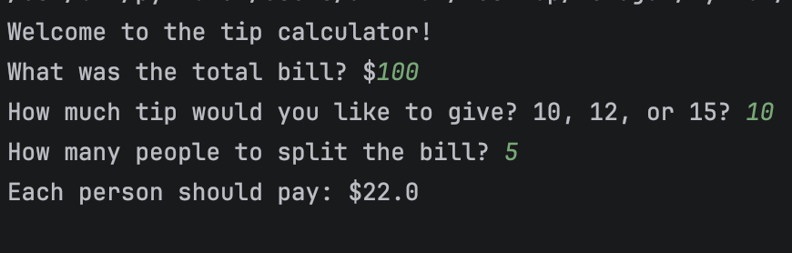

<h1 align="center">Tip Calculator</h1>

<p align="center">
  
  
</p>

<p align="center">  </p>


<h3 align="center">
  A simple Python CLI application that calculates how much each person should pay when splitting a bill with tip.
</h3>

---

## 📘 About The Project

Tip Calculator is a beginner-friendly command line program written in Python. It helps users calculate how much each person should pay when splitting a bill, including a selected tip percentage.

The user provides:

* Total bill amount
* Tip percentage (10%, 12%, or 15%)
* Number of people splitting the bill

The program then calculates and displays how much each person should pay.

This project reinforces practical real-world math logic using basic Python concepts.

---

## 💡 Why This Project Exists

This project strengthens foundational programming skills by applying:

* Type conversion (`float`, `int`)
* Arithmetic operations
* Percentage calculations
* User input handling
* Formatted string output

It bridges simple coding exercises with everyday financial calculations.

---

## 🖼 Screenshot 


---

## 🛠 Tech Stack

| Technology | Usage                           |
| -------- | ------------------------------- |
| Python 3 | Core CLI logic and calculations |

No external libraries are required.

---

## ✨ Features

* Interactive CLI prompts
* Automatic tip percentage calculation
* Bill splitting across multiple people
* Rounded final output to 2 decimal places
* Lightweight and dependency-free

---

## 🚀 Getting Started

### Prerequisites

* Python 3 installed
* Terminal access (macOS, Linux, or Windows)

### Installation

```bash
git clone https://github.com/ZygmaCore/Tip_Calculator.git
cd Tip_Calculator
```

No additional packages are required.

---

## ▶️ Usage

Run the program using:

```bash
python3 main.py
```

### Example Output

```text
Welcome to the tip calculator!
What was the total bill? $100
How much tip would you like to give? 10, 12, or 15? 10
How many people to split the bill? 5
Each person should pay: $22.0
```

---

## 🧠 Source Code

```python
print("Welcome to the tip calculator!")

total = float(input("What was the total bill? $"))
tip = int(input("How much tip would you like to give? 10, 12, or 15? "))
split = int(input("How many people to split the bill? "))

pay = (total + (total * (tip/100))) / split

print(f"Each person should pay: ${round(pay,2)}")
```

---

## 📄 License

Distributed under the MIT License.

* [https://github.com/ZygmaCore/Band_Name_Generator](https://github.com/ZygmaCore/Band_Name_Generator)
* [https://alhikam.me](https://alhikam.me)
